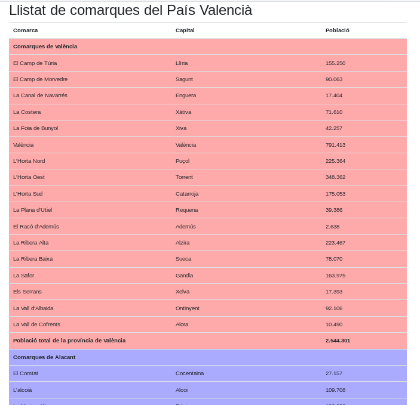

# Comarques

En aquests exemples treballarem sobre una API REST que ens proporciona el servidor amb les comarques del País Valencià ordenades per províncies. També podrem obtenir informació addicional, com la població, una descripció o una imatge representativa.

El servidor respon a les següents peticions:

* `api/provincies` (l'adreça completa seria: `http://127.0.0.1:8000/api/provincies`), que ens retorna un JSON amb les tres províncies.
* `api/comarques/:provincia` (una adreça podría ser `http://127.0.0.1:8000/api/comarques/València`), que ens retorna un JSON amb les comarques de la província indicada i les seues capitals.
* `/api/capitals/:comarca` (una adreça podría ser `http://localhost:8000/api/capitals/Els Serrans`), que ens retorna un text amb la capital de la comarca indicada. Es tracta d'informació redundant, ja que amb `api/comarques/:provincia` obtenim un vector de parells *comarca-capital*, però ens servirà per veure algun exemple on encadenarem diverses peticions.
* `api/poblacio/:comarca` (una adreça podría ser `http://localhost:8000/api/poblacio/La%20Safor`) que ens retorna un text amb la població de la comarca indicada. Si necessitem utilitzar-la com a número, haurem d'eliminar els "." que hi aparéixer i fer la corresponent conversió.
* `api/img/:comarca` (una adreça podría ser `http://localhost:8000/api/img/La%20Ribera%20Alta`) que ens retorna una URL de la Wikipèdia amb una imatge a Internet representativa de la comarca.
* `api/descripcio/:comarca` (una adreça podría ser `http://localhost:8000/api/descripcio/La%20Marina%20Baixa`) que ens retorna la descripció que fa la wikipèdia sobre cada comarca.

A més dels mètodes anteriors, disposeu també de les seues versions *amb retard*, que afigen un xicotet retard aleatori per tal de donar resposta, i que utilitzarem amb alguns exercicis:

* `api/provDelay`, versió amb retard de `api/provincies`.
* `api/comDelay/:provincia`, versió amb retard de `api/comarques/:provincia`.
* `/api/capDelay/:comarca`, versió amb retard de  `/api/capitals/:comarca`
* `api/pobDelay/:comarca`, versió amb retard de  `api/poblacio/:comarca`.
* `api/imgDelay/:comarca`, versió amb retard de `api/img/:comarca`.
* `api/descDelay/:comarca`, versió amb retard de `api/descripcio/:comarca`.

## Exercici 1

* Crea dues llistes desplegables en un formulari, de manera que la primera permeta seleccionar entre les tres províncies, i en el moment en què se'n seleccione una, s'òmpliga, de forma dinàmica la llista desplegable amb les comarques de la província.

## Exercici 2

* Realitza una funció amb javascript per generar una taula amb les capitals de comarca, ordenades per províncies. Pots marcar a quina província pertany cada comarca amb el color de fons de les files. Feu ús de crides AJAX amb l'objecte XMLHttpRequest, i no és necessari que realitzeu cap control de l'asincronía, de moment.

## Exercici 3

El més probable, és que a l'exercici anterior, com que no hem realitzat cap control asíncron, hages vist en algun moment com hi ha files de la taula corresponents a una província que apareixen entrellaçades amb les d'altra. Si ara provem el mateix codi que hem fet, però modificant les crides a l'API per la seua versió amb retard, apreciarem amb més claredat aquesta situació:

Per tal de resoldre aquesta situació s'empren diferents tècniques de control de l'asincronía: callbacks amb nom, promeses, generadors, async-await, etc.

Es demana:

### Exercici 3.1.

* Partint del codi anterior, fes ús de la seqüenciació de respostes mitjançant callbacks, de manera que les províncies i les comarques apareguen de forma ordenada en la taula.

### Exercici 3.2.

* Realitza ara la seqüenciació de respostes fent ús del mecanismes de les *Promeses*, i les funcions que aquestes ofereixen per a tal efecte.

## Exercici 4

Anem a generar ara una altra taula, basant-nos en l'exercici 3, que afisca la columna *Població*, amb la població total de cada capital. A més, haurà d'afegir una fila abans de començar a llistar les comarques d'una província, indicant la povíncia de la que es tracta, i una altra fila, en finalitzar, mostrant la suma total de la població de totes les comarques de la província:

### Exercici 4.1. 

* Realitza la implementació que resolga el problema anterior mitjançant crides AJAX i funcions de callback.

### Exercici 4.2. 

* Realitza la implementació que resolga el problema anterior fent ús de crides AJAX i promeses.

